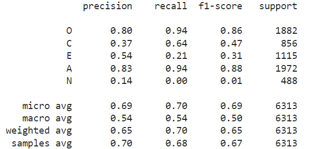
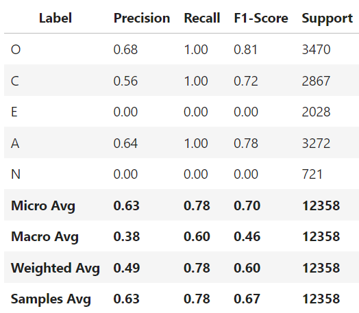
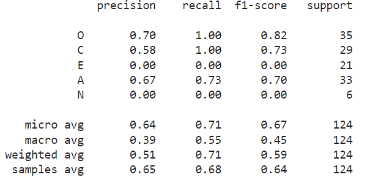
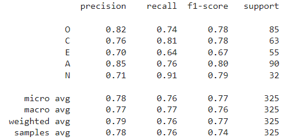

## Personality Prediction of Instagram Users
Understanding personality traits from online behavior is increasingly relevant in fields like psychology, marketing, and user experience design. 
In this project, we developed deep learning models to predict the OCEAN personality traits (Openness, Conscientiousness, Extraversion, Agreeableness, Neuroticism) based on Instagram posts, combining image and text data to derive insights into user personalities. 

### Project Overview

1. **Data Collection**:
   - Using the Meta Developer Graph API Explorer, we gathered post URLs, captions, and dates from public profiles.
   - Data was stored in JSON files, which were then converted to CSV format.
   - Images were stored in a shared drive.

2. **Data Preparation**:
   - Normalized and resized images.
   - Cleaned textual data by removing stop words, special characters, annotations, and URLs.
   - Converted emojis to text, separated hashtags, and added new attributes (e.g., frequency and length of captions, number of mentions, and hashtags).

3. **Data Analysis**:
   - Visualized data distribution.
   - Created a correlation matrix.
   - Analyzed dependencies between attributes and personality traits.

4. **Model Development**:
   - **Image-Based Models**:
     - Simple CNN
     - CNN based on pretrained VGG16
     - CNN based on pretrained ResNet18
   - **Text-Based Models**:
     - BERT tokenization
     - Data augmentation via translation (English to French and back to English)

5. **Model Evaluation**:
   - Used confusion matrices for each label.
   - Calculated macro, micro, and weighted metrics (accuracy, F1 score, recall).

6. **Deployment**:
   - Implemented a Flask application/dashboard for real-time testing and deployment of the models.

7. **Results**:

#### Image-Based Models:

- **Simple CNN**:

  

  *Figure 1: Classification report for the Simple CNN model.*

- **VGG16 (Pretrained)**:

  

  *Figure 2: Classification report for the VGG16 model.*

- **ResNet18 (Pretrained)**:

  

  *Figure 3: Performance of ResNet18.*

#### Text-Based Models:

- **BERT**:

  

  *Figure 4: Classification report for the BERT model.*

  

---
### Project Structure

- **data/**: Contains the collected data.
- **models/**: Lists the trained models.
- **modules/**: Includes the steps of the project:
  - **data_collection/**: Data preparation and web scraping.
  - **data_analysis/**: Visualization.
  - **models_training/**: Training scripts for image-based (CNN/VGG16/ResNet18) and text-based (BERT) models.

---
[Presentation Link](https://www.canva.com/design/DAGHL5NdVKo/qnu_lm-lvXfLayvd5uPz5g/edit)
---
This project was created by a group of INSAT students who are passionate about Data Science and Deep Learning.
